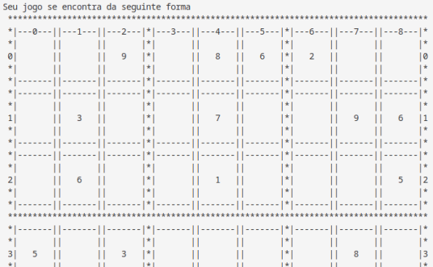
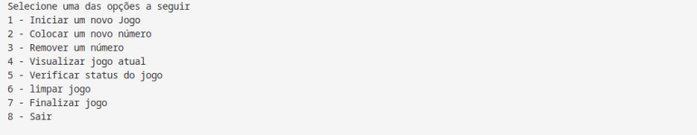
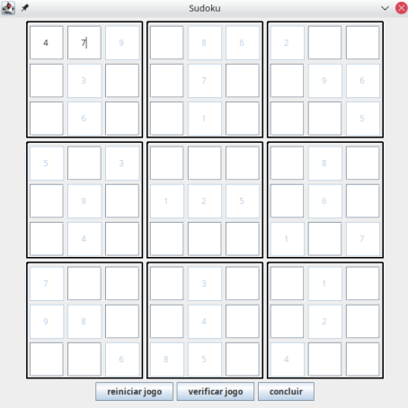

## Jogo de Sudoku

### Requisitos
Deve-se ter um menu interativo onde poderemos escolher entre as seguintes opções:

1. **Iniciar um novo o jogo**: Deve-se exibir na tela o jogo inicial, com os espaços preenchidos somente pelos números iniciais (usar os args do método main para informar os números iniciais e suas devidas posições);

2. **Colocar um novo número**: Deve-se solicitar as seguintes informações do jogador (número a ser colocado, indice horizontal e indice vertical do número), não se deve permitir que seja colocado um número em uma posição que já esteja preenchida ( seja número fixo ou informado pelo jogador);

3. **Remover um número**: deve-se solicitar os índices verticais e horizontais do número que deseja remover ( caso o número seja um número fixo do jogo deve-se exibir uma mensagem informando que o número não pode ser removido);

4. **Verificar jogo**: Vizualizar a situação atual do jogo;

5. **Verificar status do jogo**: Deve-se verificar o status atual do jogo ( não iniciado, incompleto e completo) e se contém ou não erros ( o jogo está errado quando tem números em posições conflitantes) todos os status do jogo podem conter ou não erros, exceto o status não iniciado que é sempre sem erro;

6. **Limpar**: remove todos os números informados pelo usuário e mantém os fixos do jogo;

7. **Finalizar o jogo**: Se o jogo estiver com todos os espaços preenchidos de forma válida o jogo é encerrado, senão informar ao usuário que ele deve preencher todos os espaços com seus respectivos números;

### Imagens do jogo

- **Sem interface gráfica**

    - Parte da visualização da tela do jogo

        
    
    
 

    - Menu de opções do jogo

        

- **Com interface gráfica**

    - Tela do jogo

        

